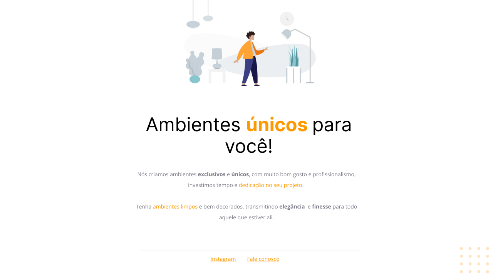

<h1 align="center">Projeto #01 - Móveis Customizados</h1>

  Desafio de construção de layout com HTML e CSS.

  <a href="#-tecnologias">Tecnologias</a>&nbsp;&nbsp;&nbsp;|&nbsp;&nbsp;&nbsp;
  <a href="#-projeto">Projeto</a>&nbsp;&nbsp;&nbsp;|&nbsp;&nbsp;&nbsp;
  <a href="#memo-licença">Licença</a>

  

 

  

## 🚀 Tecnologias

Esse projeto foi desenvolvido com as seguintes tecnologias:

- HTML
- CSS

## 💻 Projeto

Página WEB ensinada durante as aulas do Explorer para ensino introdutório
das tecnologias HTML e CSS.

## 📝 Licença

Esse projeto está sob a licença MIT.

## Autor

 

Feito com 💜 por Jordane Chaves